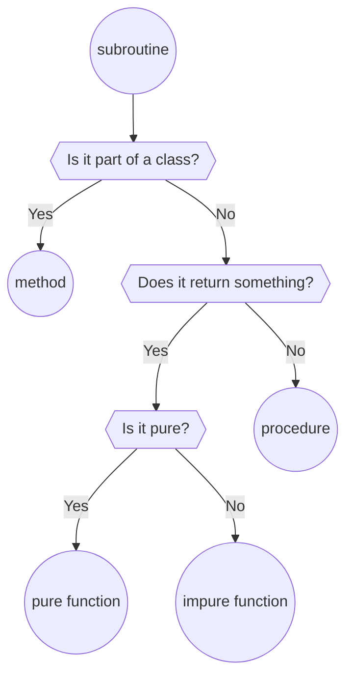

# subroutine-flowchart
A simple flowchart to help discern between methods, (pure and impure) functions and procedures.

```mermaid
flowchart TB
    A((subroutine))-->B{{Is it part of a class?}}
    B-- Yes -->C((method))
    B-- No -->D{{Does it return something?}}
    D-- Yes -->E{{Is it pure?}}
    D-- No -->F((procedure))
    E-- Yes -->G((pure function))
    E-- No -->H((impure function))
```
